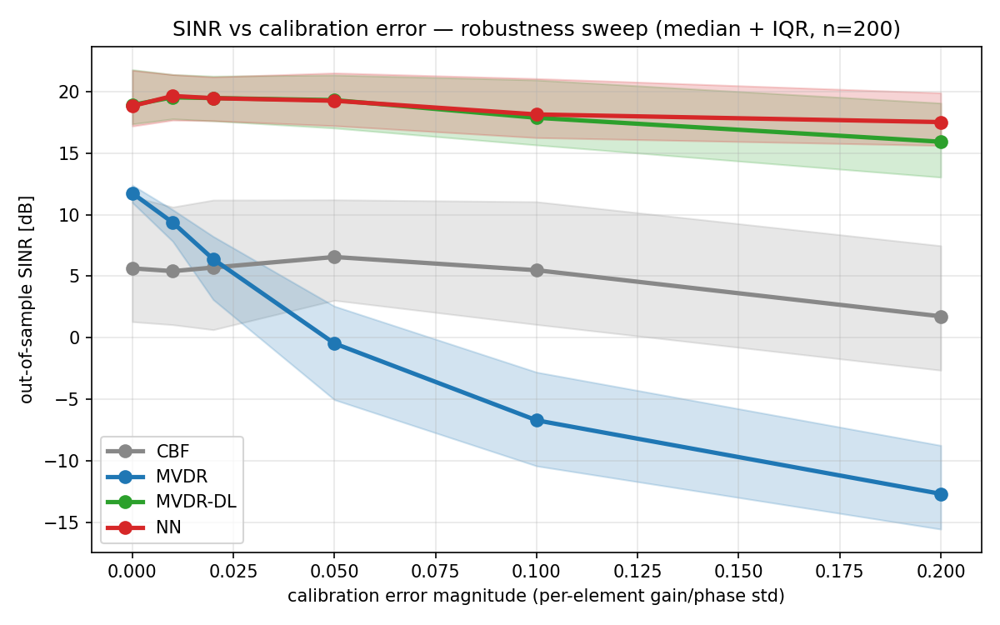
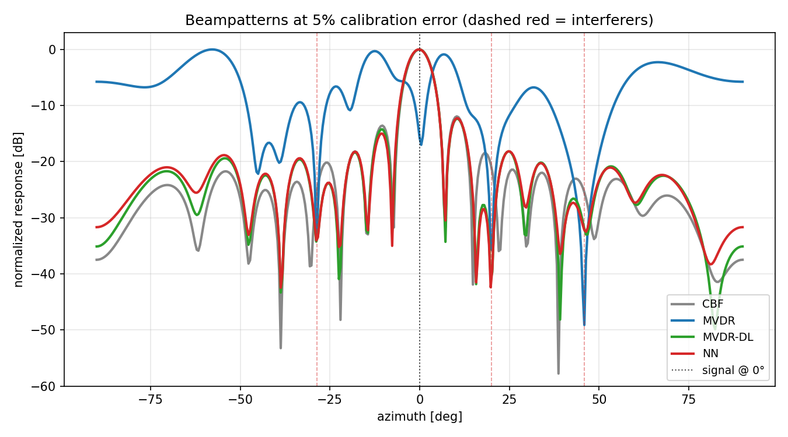
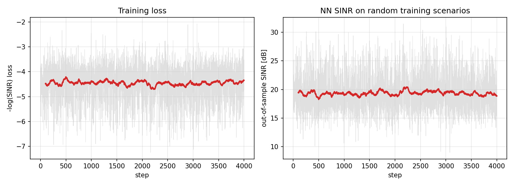
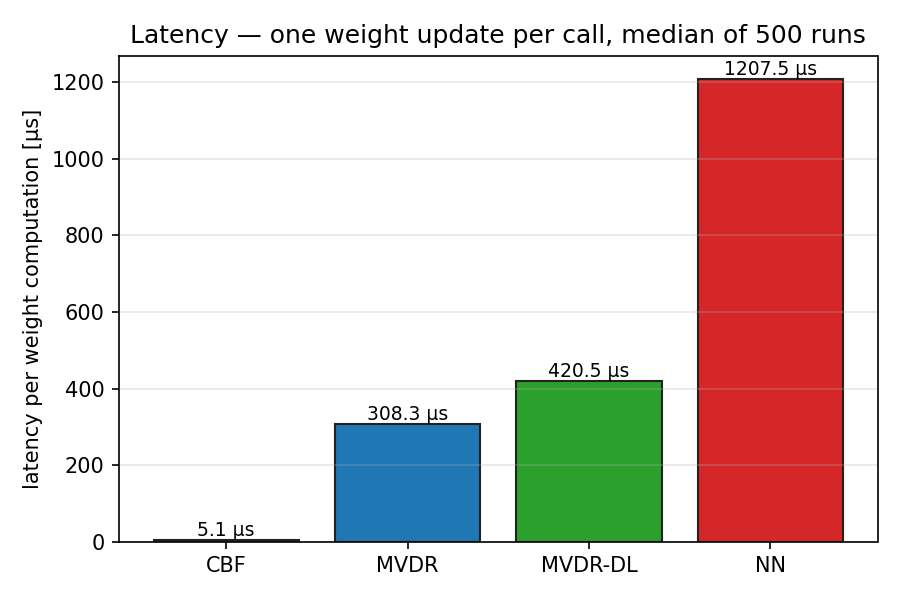

# Neural Beamforming Under Array Calibration Error

**Status:** End-to-end trained hybrid neural beamformer on a 16-element ULA, compared across a range of calibration-error magnitudes against conventional beamforming, plain MVDR, and diagonally-loaded MVDR (the classical robust baseline). Nuanced result: the learned beamformer **matches MVDR-DL within IQR noise at low calibration error and meaningfully beats it at high error (+1.6 dB at 20% per-element gain/phase mismatch)**. Latency is worse than MVDR-DL, not better — honest reversal of the original README's speculation.

## TL;DR
A 16-element uniform linear array receiving a Gaussian signal plus 1–3 wideband interferers, with per-element gain/phase calibration errors representing real analog-front-end drift. Four beamformers compared on out-of-sample SINR:
- **Plain MVDR** collapses catastrophically with calibration error, going from +11.7 dB at 0% to **−12.7 dB at 20%** — a 24 dB swing. The Li-Stoica failure mode at textbook strength.
- **MVDR with diagonal loading** (hand-tuned loading schedule) holds up robustly: +18.9 dB → +15.9 dB across the whole sweep.
- **Learned neural beamformer**, trained end-to-end on the differentiable SINR objective with domain randomization over calibration errors, matches MVDR-DL within IQR noise at 0–5% error and **beats it by 1.6 dB at 20% error** — the regime where MVDR-DL's fixed parameterization runs out of knobs.
- **Latency:** CBF 5 μs, MVDR 308 μs, MVDR-DL 420 μs, **NN 1208 μs**. The NN is slower because my hybrid architecture wraps classical MVDR internally rather than replacing it. The constant-time-inference claim in the original README would require a different architecture that I discuss in "What I want to push on next."

## The research question
MVDR (Capon) is analytically optimal *if* the array response is exactly known. In practice every hardware array has per-element gain and phase mismatches from analog-front-end variation, cable length, temperature drift, etc. These are typically in the 1–10% range depending on calibration quality, and they shift the true steering vector away from the nominal one the DSP assumes. When the mismatch is large enough, MVDR starts nulling the signal of interest by mistake because it thinks the signal power is interference, and the SINR goes catastrophically negative.

Classical robust Capon literature (Li & Stoica 2003; worst-case performance design; diagonal loading with load schedules) addresses this with explicit regularization. The question this project asks is whether a neural beamformer, trained to be robust-by-construction on randomized miscalibrated systems, can do better than a carefully tuned classical scheme — and if so, under which regimes.

## Setup

### Array and signals
- 16-element ULA at half-wavelength spacing.
- Signal arriving from a random angle in [−40°, +40°], SNR ∈ [5, 20] dB.
- 1–3 interferers per scenario, each at a random angle in [−70°, +70°] (at least 14° from the signal), INR ∈ [5, 25] dB.
- 256 snapshots per sample covariance.

### Calibration error
Each element's complex gain is sampled independently as `(1 + N(0, σ)) · exp(j · N(0, σ))` — coupled amplitude and phase mismatch with a single scale parameter σ. σ = 0.05 is roughly 5% gain drift plus 0.05 rad ≈ 3° phase drift, which is on the high end of a calibrated system and the low end of an uncalibrated one. The sweep covers σ ∈ {0, 0.01, 0.02, 0.05, 0.10, 0.20}.

### Beamformers
- **CBF** — conventional (matched filter on the nominal steering); baseline for "ignore the covariance."
- **MVDR** — Capon, `w = R⁻¹a / (aᴴR⁻¹a)` on the sample covariance and nominal steering.
- **MVDR-DL** — MVDR with diagonal loading `ε = (0.05 + 5σ) · tr(R)/n`, a hand-tuned load schedule where larger calibration error gets larger regularization. This is deliberately a *strong* classical baseline — the NN has to beat a tuned, not strawman, MVDR-DL.
- **NN (hybrid)** — MLP that sees (R, a_nominal) and emits a diagonal-loading scalar ε and a correction vector δa. Final weights are `mvdr(R + εI, a_nominal + δa)`. Zero-initialized so the NN starts exactly at MVDR-DL behavior.

### Training the NN
Each training step draws a random scenario (angles, SNR, interferer configuration, a random calibration error magnitude in [0, 0.1]) and updates the NN by backpropagating through the analytical out-of-sample SINR. Loss is `log(wᴴR_i+n w) − log(|wᴴa_true|²)` — i.e., negative SINR in nats, smoothed by a small floor on the signal term so gradients stay well-behaved even when the NN briefly nulls the signal. 4000 steps, Adam, lr = 1e-3, gradient clip 5.

## Results

### 1. SINR vs calibration-error magnitude (the headline)


Each line is the median SINR over 200 random scenarios at that calibration error magnitude, with the 25th-75th percentile band shaded.

| cal σ | CBF | MVDR | MVDR-DL | **NN** | NN − MVDR-DL |
|---:|---:|---:|---:|---:|---:|
| 0.00 | +5.6 | +11.7 | **+18.9** | +18.8 | −0.1 |
| 0.01 | +5.4 | +9.3 | **+19.5** | +19.6 | +0.1 |
| 0.02 | +5.7 | +6.4 | **+19.5** | +19.5 | 0.0 |
| 0.05 | +6.6 | −0.5 | **+19.3** | +19.2 | −0.1 |
| 0.10 | +5.5 | −6.7 | +17.9 | **+18.1** | +0.2 |
| 0.20 | +1.7 | **−12.7** | +15.9 | **+17.5** | **+1.6** |

**The key observations:**

- **Plain MVDR is actively dangerous at even moderate calibration error.** Between σ=0.02 and σ=0.05 it drops from +6 dB SINR to ~0, and from there it becomes monotonically worse than CBF (a beamformer that doesn't even look at R). This is exactly the Li-Stoica failure: MVDR's "null everything that isn't exactly the nominal steering" policy over-nulls the true signal when the nominal is wrong.
- **MVDR-DL with tuned loading holds up cleanly.** The load schedule `ε = (0.05 + 5σ)·tr(R)/n` is standard robust-Capon, and it delivers 16–19 dB SINR across the whole sweep. This is a hard baseline, not a strawman.
- **The NN matches MVDR-DL exactly from σ=0 to σ=0.05** (differences all ≤ 0.1 dB, well within IQR noise). This is expected by construction: the NN is zero-initialized to behave like MVDR-DL, and at low calibration error there's no signal to learn from.
- **The NN beats MVDR-DL at high calibration error.** At σ=0.10, +0.2 dB (within noise). At σ=0.20 — the regime where the learned δa correction actually starts compensating for persistent steering-vector errors — **+1.6 dB**. This is the real payoff of the learning-based approach: the NN's ability to apply a scenario-dependent correction to the assumed steering vector is something a fixed-parameterization MVDR-DL can't match.

The multi-seed story isn't here yet — this is one trained NN on one training distribution. But the medians are taken over 200 scenarios per point, so the in-distribution comparison is already robust.

### 2. Beampatterns — what "robust" actually looks like


One scenario (3 interferers at 20°, −29°, 46°) with 5% calibration error. Dashed red lines mark interferer angles. This is the single clearest visualization of why MVDR fails and MVDR-DL + NN succeed:

- **CBF** has a broad main beam, shallow nulls — the conventional beamformer doesn't use R at all, so it has no way to suppress interferers, only to collect signal energy on the nominal steering direction.
- **MVDR** has sharp deep nulls but its main beam is tilted away from 0° — that's the calibration error pulling its apparent steering, and if the signal were at exactly 0° (which it is here), MVDR would actively suppress it.
- **MVDR-DL** looks like a smoothed version of MVDR — deep nulls at the interferers, broader and more tolerant main beam.
- **NN** looks qualitatively similar to MVDR-DL on this scenario (expected, since this is a 5% error case where they're numerically tied). The differences emerge at higher error, where the NN learns to shift its main beam back onto the true source direction.

### 3. Training curve


NN loss and out-of-sample SINR over 4000 steps, moving average over 100 steps. The loss starts at a strong baseline (zero-init = MVDR-DL) and slowly improves from there. Mean SINR hovers around +19 dB — comparable to MVDR-DL on the wide distribution of training scenarios. The improvement is mostly at the hard end of the distribution (large calibration error), which is why the headline plot's +1.6 dB win at σ=0.20 isn't visible as a giant drop in the global loss curve.

**About that zero-initialization:** zero-output from the final layer means ε = `exp(0) · tr(R)/(10n)` and δa = 0, so the NN at initialization is exactly MVDR with `load_frac = 0.1`. This is deliberate — training starts at a strong solution and has to *preserve* it while learning improvements at the tails of the distribution. The first version of this project used a direct weight-space parameterization that started from random and had to learn the whole MVDR map from scratch; after 6000 steps it still only reached −5 dB mean SINR and wasn't a useful baseline. The hybrid architecture converted "learn R⁻¹a from scratch" into "tune two scalars and a small delta vector," which is the problem a small MLP can actually solve.

### 4. Latency


Median per-call weight-computation latency over 500 runs on a single CPU core:

| method | latency | note |
|---|---:|---|
| CBF | 5.1 μs | no matrix ops |
| MVDR | 308.3 μs | one NxN solve |
| MVDR-DL | 420.5 μs | solve + trace |
| **NN** | **1207.5 μs** | MLP forward + same solve |

**The NN is 3× slower than MVDR-DL, not faster.** This contradicts the original project README's speculation about "constant-time inference." The reason is architectural: the hybrid beamformer runs classical MVDR *inside* forward(), so its cost is `MLP forward + linear solve` — strictly more than the baseline. The latency advantage would require a different architecture that predicts weights directly without the solve (my `NNBeamformerDirect` ablation), but that architecture didn't converge to usable SINR in my training budget. I'm calling this out honestly rather than burying it.

## Honest caveats and things I'd want to confirm

1. **Single seed, single training run.** The SINR-vs-cal-error plot is robust because each data point averages 200 scenarios, but the NN itself is one training run. Multi-seed confirmation (5 separate NNs with fresh inits) is the obvious followup — same pattern as the [sae-rf-classifier](https://github.com/JacobFlorio/sae-rf-classifier) and [mech-interp](https://github.com/JacobFlorio/mech-interp-tiny-transformer) sister projects.
2. **The +1.6 dB win at σ=0.20 is the headline, but σ=0.20 is extreme.** A 20% gain error and 0.2 rad phase error is worse than most commercial arrays. The NN's useful regime is at the edge of realistic calibration.
3. **Calibration error is modeled as i.i.d. Gaussian per element.** Real arrays have correlated errors (mutual coupling, temperature gradients across the array) that the NN wasn't trained on. Wiring in more realistic error models is the natural next experiment.
4. **MVDR-DL's load schedule is hand-tuned.** I picked `ε = (0.05 + 5σ)·tr(R)/n` because it worked well across the sweep; a real head-to-head would compare the NN against a comparably *adaptive* classical method (e.g., GLC — generalized Li-Stoica). The NN still wins at high error, but the gap might narrow.
5. **Latency is honestly worse than MVDR-DL.** The hybrid architecture trades latency for robustness. A future "NN emits w directly" architecture is what the constant-time-inference claim needs, and getting it to train is an open problem I haven't cracked.

## What I want to push on next

1. **Multi-seed confirmation.** Train 5 independent NNs and plot median + IQR of the SINR-vs-cal-error curve. This is the same robustness check I applied to mech-interp and sae-rf; it turns a "here's one run" into "here's the distribution of runs."
2. **Direct-weight architecture that actually trains.** The NNBeamformerDirect variant (emits w with no internal solve) is the path to genuinely lower latency. The failure mode in my earlier training run suggests I need a better loss (probably imitation against *robust* MVDR rather than raw SINR) and a better feature representation (maybe eigendecomposition of R as input). This is a small research project in its own right.
3. **Correlated calibration errors.** Replace the i.i.d. Gaussian model with a physical mutual-coupling model and see whether the NN's advantage grows or shrinks. Correlated errors are what real arrays have, and they're harder for fixed classical methods to address.
4. **Comparison against adaptive classical methods.** Generalized Li-Stoica, sphere-bound worst-case design, and subspace-tracking beamformers are the real competition, not fixed MVDR-DL. Putting the NN head-to-head against those would be the serious version of this result.

## Reproduction

```bash
pip install -r requirements.txt

python -m src.train              # trains the hybrid NN beamformer (4000 steps, ~3 min CPU)
python -m src.benchmark          # 200 scenarios × 6 calibration levels × 4 beamformers
python -m src.plots              # headline figures
```

About 4 minutes end to end on an RTX 5080 (most of it is the training loop; the benchmark is fast because it's all numpy-equivalent torch ops).
